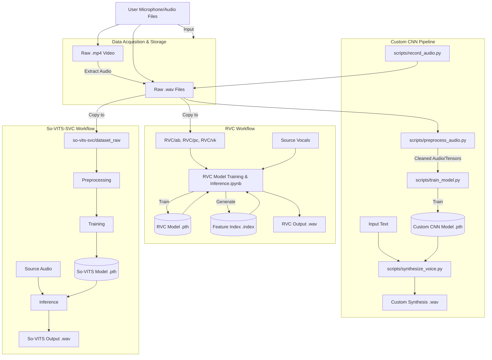

# System Architecture

This document provides a technical overview of the Voice Cloning software, detailing its core components, data flow, and model architecture.

## High-Level Overview

The system is designed as a pipeline that transforms raw audio input into a trained voice model capable of synthesis. The workflow consists of four main stages:
1.  **Data Acquisition**: Capturing raw voice samples.
2.  **Preprocessing**: Cleaning and formatting audio data.
3.  **Training**: Learning voice characteristics using a Convolutional Neural Network (CNN).
4.  **Inference (Synthesis)**: Generating new audio based on the trained model.

## Component Design

### 1. Data Acquisition Module
*   **Script**: [`scripts/record_audio.py`](scripts/record_audio.py)
*   **Function**: Captures real-time audio from the user's microphone.
*   **Key Logic**:
    *   Uses `pyaudio` to interface with audio hardware.
    *   Records in chunks to manage memory efficiency.
    *   Saves outputs as `.wav` files in `data/raw_recordings`.
    *   Implements file naming conventions to prevent overwrites.

### 2. Preprocessing Module
*   **Script**: [`scripts/preprocess_audio.py`](scripts/preprocess_audio.py)
*   **Function**: Prepares raw audio for model training.
*   **Key Logic**:
    *   **Noise Reduction**: Utilizes the `noisereduce` library to remove background static using spectral gating.
    *   **Normalization/Formatting**: Ensures consistent sample rates and tensor shapes.
    *   **Output**: Converts processed audio into PyTorch tensors (`.pt`) or cleaned `.wav` files for the training loop.

### 3. Model Architecture (CNN)
The core voice cloning logic is implemented using a Convolutional Neural Network (CNN). There are currently two variations present in the codebase (`VoiceCloningModel` in synthesis and `SimpleCNN` in training), sharing a similar architectural philosophy:

*   **Input**: Mel-spectrograms or raw waveform tensors (depending on the specific pipeline configuration).
*   **Feature Extraction (Encoder)**:
    *   **Convolutional Layers**: 2-3 layers of 2D convolutions (`nn.Conv2d`) to extract time-frequency features from the audio.
    *   **Activation**: ReLU activation functions for non-linearity.
    *   **Pooling**: Max pooling (`nn.MaxPool2d`) to downsample spatial dimensions and reduce computational complexity.
*   **Classification/Regression (Decoder)**:
    *   **Flattening**: Converts 2D feature maps into 1D vectors.
    *   **Fully Connected Layers**: Dense layers (`nn.Linear`) to map features to the target voice latent space.
    *   **Output**: A representation that can be reconstructed into audio or classified.

### 4. Inference Engine
*   **Script**: [`scripts/synthesize_voice.py`](scripts/synthesize_voice.py)
*   **Function**: Generates speech from text using the trained model.
*   **Pipeline**:
    1.  **Text Processing**: Converts input text into numerical representations (e.g., Mel-spectrograms).
    2.  **Model Forward Pass**: Feeds the representation through the loaded `VoiceCloningModel`.
    3.  **Vocoding/Reconstruction**: Converts the model output back into audible waveforms.
    4.  **Output**: Saves the result as a `.wav` file.

## Data Flow Diagram

This diagram illustrates the three main workflows supported by the project: the Custom CNN pipeline, the RVC workflow, and the So-VITS-SVC path.

## Dependencies & Tech Stack

*   **Core Framework**: PyTorch (`torch`, `torch.nn`, `torchaudio`)
*   **Audio Processing**: `librosa` (implied), `pyaudio`, `scipy`, `pydub`, `noisereduce`
*   **Environment**: Python 3.x

## Directory Layout
*   `data/`: Stores raw and processed datasets.
*   `scripts/`: Contains the executable logic for each stage.
*   `models/`: Destination for saved `.pth` model checkpoints.
